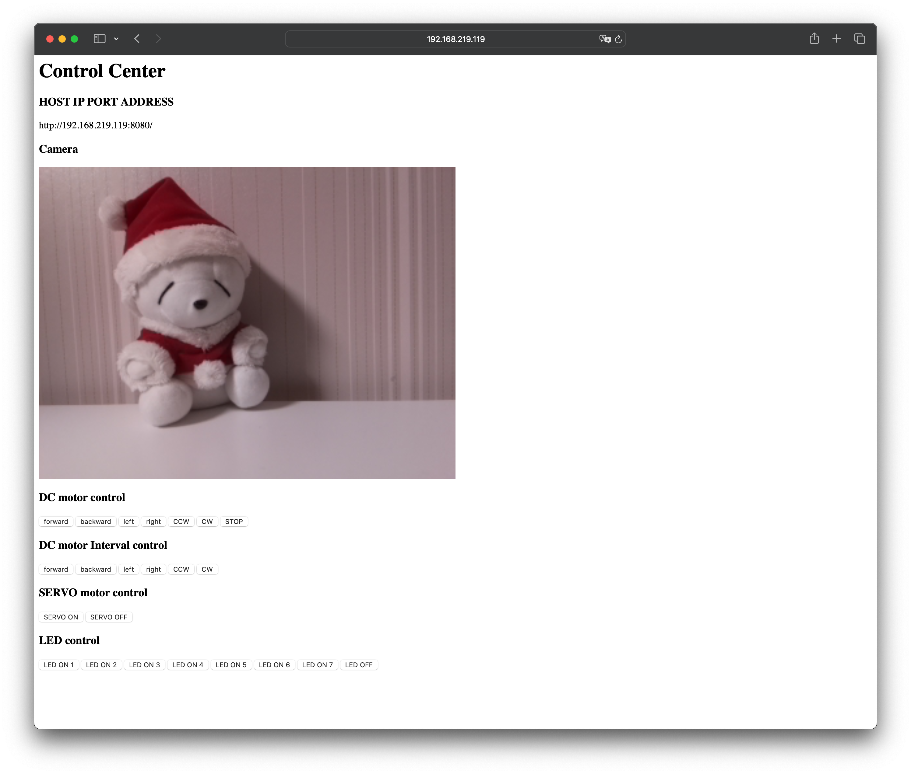

# petcar-server

[petcar-client](https://github.com/syki66/petcar-client)와 통신하는 Python `Flask` 기반 라즈베리파이 GPIO `제어 서버`



---

## Feature

- DC모터 GPIO 제어
- 서보모터 GPIO 제어
- 카메라 제어
- LED 센서 제어

---

## Usage

- 로컬 네트워크를 이용하거나, [외부 접속은 포트포워딩 이용하기](https://blog.syki66.com/2020/11/06/port-forwading/)
- [라즈베리파이 부팅 후, 자동으로 서버 실행하기](https://blog.syki66.com/2020/09/20/crontab/)

---

## Change Log

- [CHANGELOG.MD](https://github.com/syki66/petcar-server/blob/master/CHANGELOG.MD)

---

## Run

```
python app.py
```
